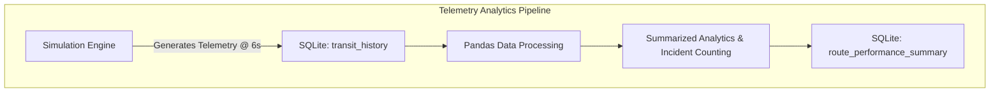

# Toronto Transit Telemetry Pipeline

An automated data pipeline and aggregate analytics engine built with Python, SQL, and Pandas to simulate, ingest, and process streetcar telemetry data.

## Key Features
- **Data Stream Simulation:** Engine generates real-time GPS coordinates, timestamps, and velocity telemetry every 6 seconds to mimic streetcar movements.
- **Window Transformations:** Calculates precise time-deltas between sequential pings using time-series delta operations.
- **Spatial Binning:** Maps continuous GPS coordinates to physical transit route segments across Toronto using `pd.cut`.
- **Incident Tracking:** Implements custom zero-velocity detection logic to flag and sum "stuck" vehicle incidents.

## Diagram



## Architecture & Core Components

### 1. Data Ingestion & Storage (SQLite)
* **Schema Definition:** Relational database schema configured via SQL (`create_transit_tables.sql`) to store raw vehicle pings and aggregated output metrics.
* **Database Driver:** Native `sqlite3` integration handling real-time data persistence and state management.

### 2. Simulation Engine
* **Telemetry Generator:** `simulation_engine.py` generates continuous GPS positional streams, velocity readings, and vehicle identifiers.
* **Interval Loop:** Simulates real-world IoT telemetry broadcasting on a continuous 6-second sleep cycle.

### 3. Analytics & Transformation Engine (Pandas)
* **Spatial Segmentation:** `analytics.py` uses `pd.cut` with predefined coordinate boundaries to partition spatial data into distinct route segments (e.g., *Woodbine --> Broadview*).
* **Vectorized Event Identification:** Evaluates stationary spatial conditions and zero speed (`speed_kmh == 0`) to derive binary `is_stuck` flags and aggregate total incident counts.

## Project Structure
```text
toronto-transit-pipeline/
├── create_transit_tables.sql
├── simulation_engine.py
├── analytics.py
├── .gitignore
└── README.md
```

## Requirements
* **Languages:** Python 3, SQL
* **Data Processing:** Pandas, NumPy
* **Database:** SQLite3
* **Environment & Tools:** VS Code, Git, DBeaver

## Setup
1. **Clone the repository:**
   ```bash
   git clone [https://github.com/aiman6ix/toronto-transit-pipeline.git](https://github.com/aiman6ix/toronto-transit-pipeline.git)
   ```
2. Ensure Python 3.x and Pandas are installed on your system.

## Usage
1. **Run Simulation Engine:** Execute the simulation engine in your terminal to start generating vehicle telemetry data:
   ```bash
   python simulation_engine.py
   ```
2. **Run Analytics Pipeline:** In a separate terminal prompt, execute the analytics script to process raw logs into aggregate performance summary tables:
   ```bash
   python analytics.py
   ```
3. **Verify Database Ingestion:** Connect to `toronto_transit.db` using DBeaver or SQLite CLI to confirm output tables:
   ```sql
   SELECT * FROM route_performance_summary;
   ```